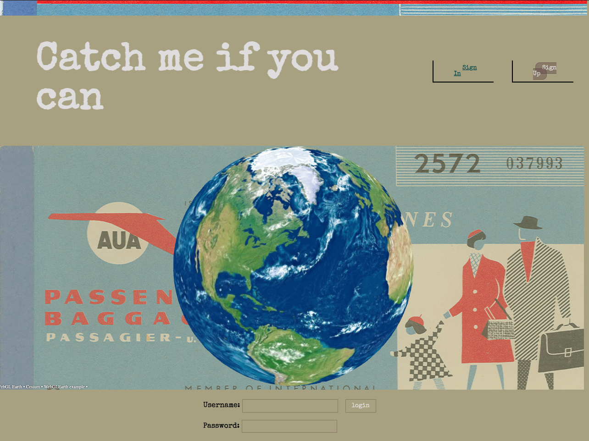
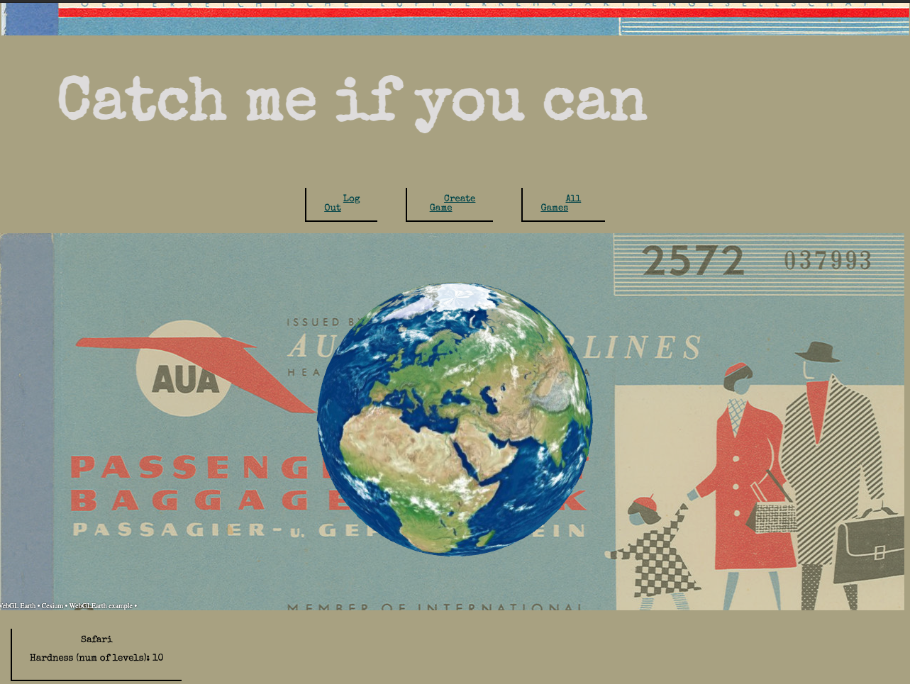

# Catch-me-if-you-can

Welcome to Catch me if you can. This application challenges you to find Frank and was built for the learning experience.

## Screenshots

## Login Page

## Game Details Page

## Technologies Used:

This project utilizes a Django server which communicates with the REST countries API and interacts with a PostgreSQL database to serve information to and challenge the user during their game.  The game uses HTML, CSS, and JS to immerse the user, along with the WebGLEarth API.  This code uses Fancy Buttons with Amazing Hover Effects by Ahmed Beheiry hosted on CodePen.io.

## Getting Started

## Planning

Our Kanban, and design documentation featuring wireframes and an ERD are hosted on Trello.

[Our Trello](https://trello.com/b/YuWgLGWK/catch-me-if-you-can)

## Next Steps

- [ ] Implement hints
- [ ] Google OAuth
- [ ] Utilize Globe and coordinates to allow user interaction for locating Frank
